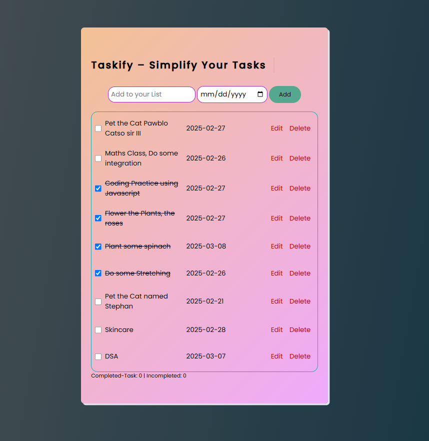
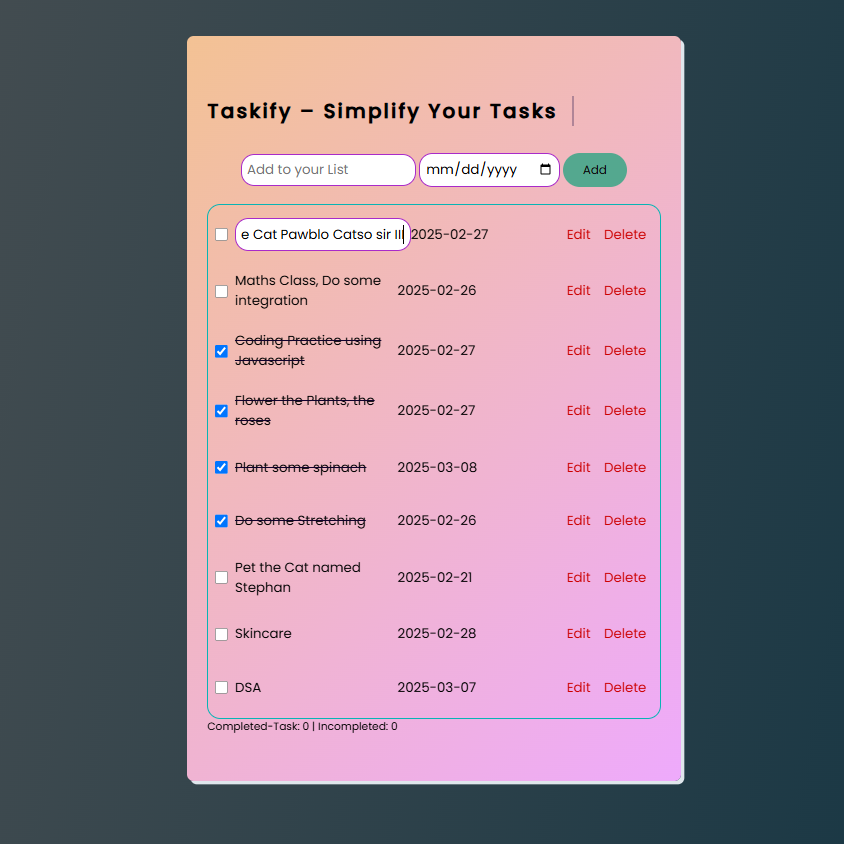
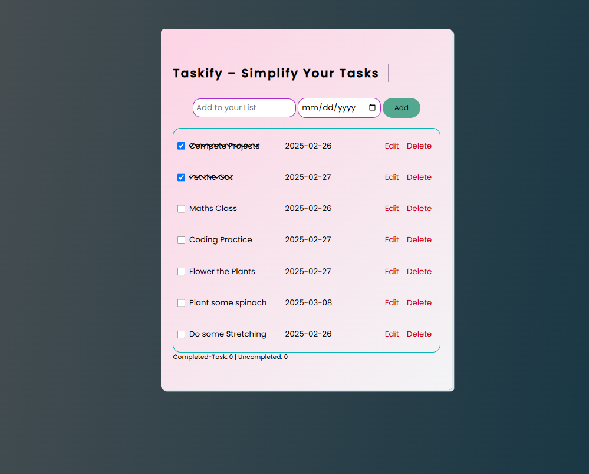

# 📝 To-Do List App

A simple **To-Do List** app built using **HTML, CSS, and JavaScript** that allows users to add, check, delete, and store tasks in the browser.

## 🚀 Features
- ➕ **Add Tasks**  
- ✅ **Mark Tasks as Completed**  
- ❌ **Delete Tasks**  
- 💾 **Save Tasks Using localStorage** (Data remains even after refreshing)

## 🚀 Updating the below features
- Count of completed task
- A lot more coming soon

## 📸 Preview

## 📂 Technologies Used
- **HTML** - Structure  
- **CSS** - Styling  
- **JavaScript** - Functionality (DOM Manipulation, Event Handling, LocalStorage)

👤 Author
👋 Built by JaysB
📌 GitHub: https://github.com/jaysreeb/To-Do-List.git